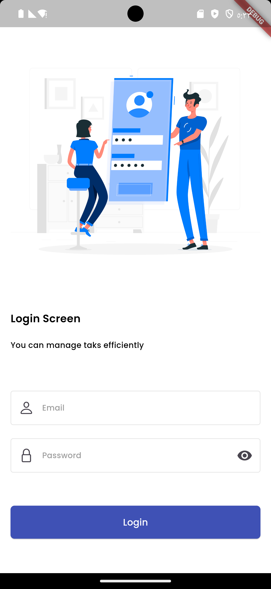
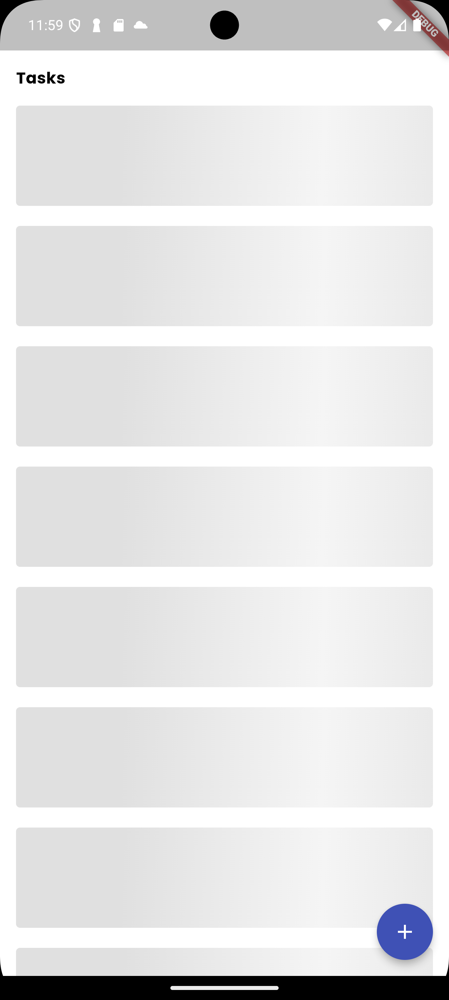
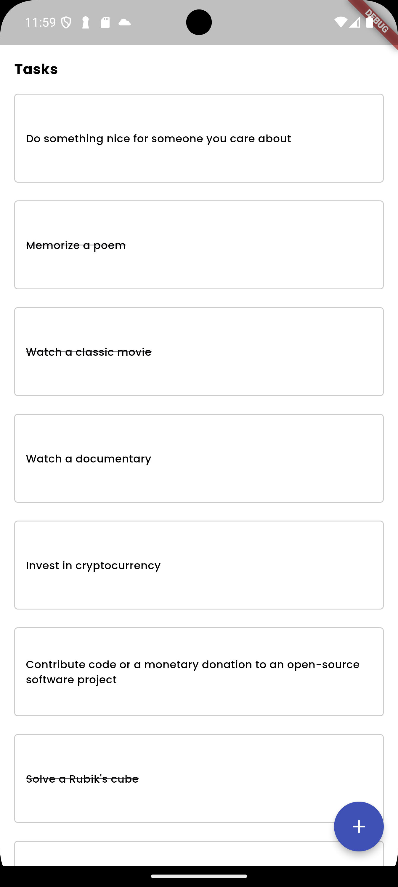
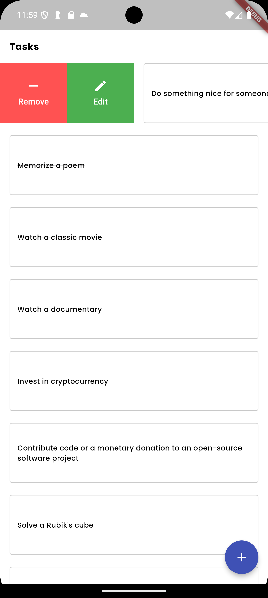

### Task Manager  
### Screenshots

|  |  |  |  |
|:--:|:--:|:--:|:--:|
| Screenshot 1 | Screenshot 2 | Screenshot 3 | Screenshot 4 |

## Features
User Authentication
Secure user authentication using DummyJSON Authentication.
Users can log in with their username and password.
Task Management
View, add, edit, and delete tasks using the DummyJSON Todo API.
Pagination
Efficiently fetch tasks with pagination
State Management
Implemented using BLoC for efficient state updates across the app.
Local Storage
Persist tasks locally using Flutter's Shared Preferences, ensuring data is retained even when the app is closed.
Unit Tests
Comprehensive unit tests cover task CRUD operations, input validation, state management, and network requests using mock responses from reqres.in.
Getting Started
# Prerequisites
Flutter SDK
Dart
An IDE (e.g., Android Studio, VSCode)
Installation:
## Installation

### For Developers

1. Clone the repository.
2. Run `flutter pub get` to install dependencies.
3. Run `dart run build_runner build` to generate necessary files.
### For Normal Users

- Download the app from Here <a href="https://www.upload-apk.com/xi3i21Yuer8HnX6" style="text-decoration:none;">
    <button style="background-color:#4CAF50; color:white; padding:10px 20px; border:none; border-radius:5px; cursor:pointer;">
        Download APK
    </button>
</a>

